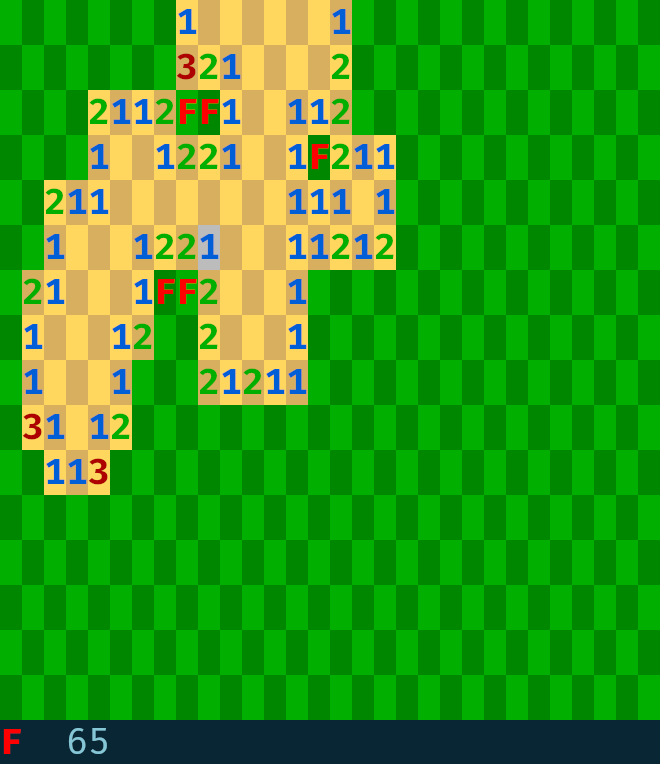

# Sharpmines
<p align="center">
  
  <br>
  <em>Sharpmines running in the terminal</em>
</p>

Sharpmines is a simple minesweeper game built with .NET 10. It's visuals are powered exclusively by ansi escape sequences. The game Is built to look similar to the minesweeper from google we all *surely* all know and love, wich you can find [here](https://www.google.com/fbx?fbx=minesweeper).

**Sharpmines is still work in progress**

## Features

The game has some QOL features, including: 
- flood fill
- [chording](https://minesweeper.online/help/gameplay)
- fast replay

and other nice features, like the ability to set games with custom board sizes, and arbitraty mine counts.

## Controls

What's better, the game *partially* supports vim motions for movement, so you don't have to take your fingers of the home row *(or, god forbid, touch the mouse)* to play.

The game's controlls are:
| control       | action      |
| ------------- | ----------- |
| HJKL / arrows | move around |
| D / Enter     | dig         |
| F / M         | toggle flag |
| Q / Esc       | quit        |

## CLI usage

The game's cli usage is as follows:

```
sharpmines <mode> [options]
```
modes are:

| mode   | board size | mine count |
| ------ | ---------- | ---------- |
| easy   | 9 by 9     | 10         |
| medium | 16 by 16   | 40         |
| hard   | 32 by 16   | 99         |
| custom | arbitrary  | arbitrary  |

The `custom` mode has 3 options, all of type int:

| option | description                |
| ------ | -------------------------- |
| -w     | board width in characters  |
| -h     | board height in characters |
| -c     | mine count                 |

## Recommendations

In this section, I'll offer some tips for a better playing experience.

### Use a bold font

The game renders the board uing the bold modifier. However, in some terminals this gets represented by just brightening the color, which makes the numbers harder to see.

In your terminal settings, check if you can set a dedicated bold font. If you cannot, most terminals offer a setting, that changes how bold letters are rendered. Select the option, that makes the letters look visually bolder.

The photo above was taken using a FiraCode bold font.

### Get good at vim motions

This will *semi* automatially make your play experience way better.

This will be even more the case, when I get to implementing:
- quantified vim motios
- ^ and $ to move horizontally
- G and gg to move vertically
