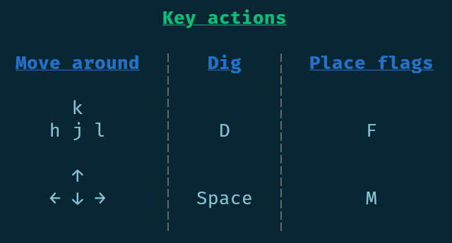

# Sharpmines
<p align="center">
  
  <br>
  <em>Sharpmines running in the terminal</em>
</p>

Sharpmines is a simple minesweeper game built with .NET 10. It's visuals are powered exclusively by ansi escape sequences. The game Is built to look similar to the minesweeper from google we all *surely* all know and love, wich you can find [here](https://www.google.com/fbx?fbx=minesweeper).

**Sharpmines is still work in progress**

## Features

The game has some QOL features, including: 
- safe first click
- guess free boards
- flood fill
- [chording](https://minesweeper.online/help/gameplay)
- fast replay

... and more to come!

## Solver

The game has a solver to find guess-free boards for you. The solver is quite fast as it can solve most of the default sized boards in under 150ms (which is what google uses for their version). If a solve takes more than the mentioned 150ms, the solver gives up, and serves you a **non guess-free board**.

> TODO: add an option to configure the solver time.

The solver has a predefined number (1000) of times it will look at a board (and make moves on it). If this number is reached, the solver goes generates a new board and tries to solve that instead. This system is in place as a safeguard. It can be configured, as seen later.

## Controls

What's better, the game *partially* supports vim motions for movement, so you don't have to take your fingers of the home row *(or, god forbid, touch the mouse)* to play.

<p align="center">
  
  <br>
  <em>The game's controls page</em>
</p>

## CLI usage

The game's cli usage is as follows:

```
sharpmines <mode> [options]
```
modes are:

| mode   | board size | mine count |
| ------ | ---------- | ---------- |
| easy   | 9 by 9     | 10         |
| medium | 16 by 16   | 40         |
| hard   | 32 by 16   | 99         |
| custom | arbitrary  | arbitrary  |

The `custom` mode has 3 options and all are full numbers:

| option | description                |
| ------ | -------------------------- |
| -w     | board width in characters  |
| -h     | board height in characters |
| -c     | mine count                 |

You can also configure solver steps (that is how many times will the solver look at a board) using the `-s` flag. Setting this to 0 will disable the solver, but the first safe click is still guaranteed.

## Recommendations

In this section, I'll offer some tips for a better playing experience.

### Use a bold font

The game renders the board uing the bold modifier. However, in some terminals this gets represented by just brightening the color, which makes the numbers harder to see.

In your terminal settings, check if you can set a dedicated bold font. If you cannot, most terminals offer a setting, that changes how bold letters are rendered. Select the option, that makes the letters look visually bolder.

The photo above was taken using a FiraCode bold font.

### Get good at vim motions

This will *semi* automatially make your play experience way better.

This will be even more the case, when I get to implementing:
- quantified vim motios
- ^ and $ to move horizontally
- G and gg to move vertically
